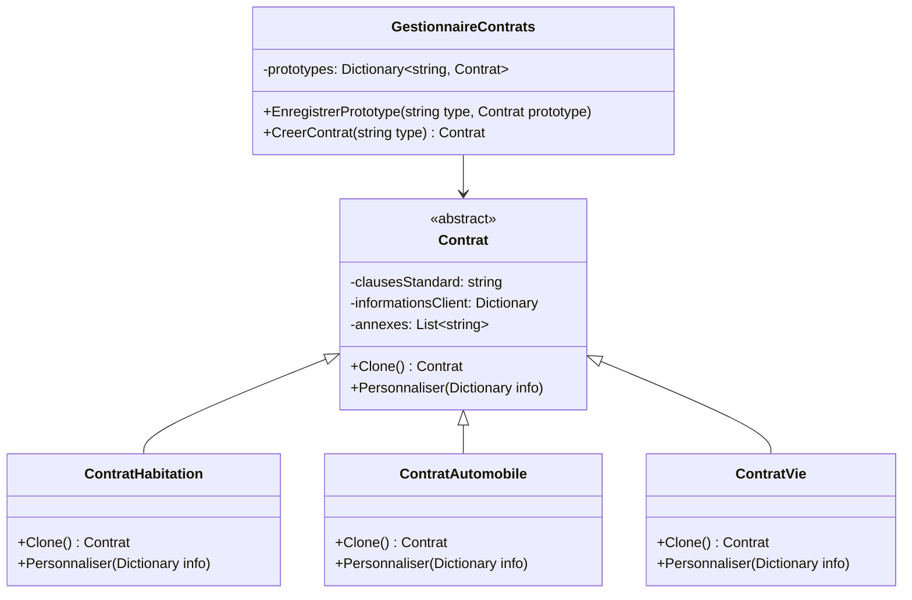

Corrigé :

1. Pattern utilisé : Prototype
   La solution utilise le pattern Prototype car il permet de :

- Créer de nouveaux objets en clonant un prototype existant
- Éviter le coût de création à partir de zéro
- Faciliter la création de variations d'un même objet

1. Structure du diagramme de classes :

- `Contrat` : classe abstraite définissant l'interface de clonage
- Classes concrètes pour chaque type de contrat
- `GestionnaireContrats` : registre des prototypes disponibles

1. Implémentation en C# :

- Méthode `Clone()` dans chaque type de contrat
- Deep copy des informations pertinentes
- Gestionnaire centralisant les prototypes
- Personnalisation via un dictionnaire d'informations

1. Avantages de la solution :

- Performance : évite la recréation coûteuse des parties standard
- Flexibilité : facilite la création de variations
- Extensibilité : nouveau type de contrat = nouvelle classe + prototype
- Isolation : les clients travaillent avec l'interface de clonage

Cette implémentation répond aux besoins initiaux en :

- Permettant la création efficace de nouveaux contrats
- Facilitant la personnalisation
- Supportant les variations multiples
- Maintenant la cohérence des clauses standard

La solution est particulièrement adaptée car elle :

- Évite la duplication de code
- Réduit le coût de création des contrats
- Permet une grande flexibilité dans les variations
- Facilite la maintenance et l'évolution du système

